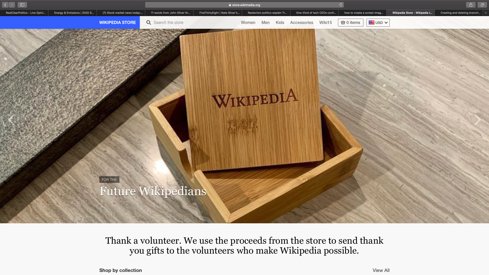

# WikiAutomation
Automated testing of WikiStore site using selenium, testNG and cucumber

## Objective
Demonstrate use of the following testing technologies and procedures as part of providing a complete testing framework.

- Selenium (All web page access)
- TestNG (Regression Testing)
- Cucumber (Acceptance Testing)
- Page Object Design (shared between TestNG and Cucumber)
- Maven (build and test)
- Log4J2 (logging)
- CircleCI (continuous build integration) 

## WikiStore Web Site to be tested

https://store.wikimedia.org

## Page Object Design

Page Object model is an object design pattern in Selenium. Web pages are represented as classes, and elements on the page are defined as variables on the class, so user interactions can then be implemented as methods on the class.

FindBy annotation are used to reference the WebElements

## TestNG

TestNG framework is an open source automated testing framework and here NG means Next Generation. TestNG is quite similar to JUnit. TestNG is inspired by the JUnit framework and it is designed in such a way that it turns out better than JUnit, when testing the integrated classes. TestNG has been created by Cedric Beust. 

TestNG is used for regression testing in this project.

Test Classes

- ValidateHomePage (in progress
- ValidateProductDetailsPage (TBD)
- ValidateCartPage (TBD)
- ValidateWomenPage (TBD)
- ValidateMenPage (TBD)
- ValidateKidsPage (TBD)
- ValidateAccessoriesPage (TBD)
- ValidateWiki15Page (TBD)

## Cucumber

Cucumber is a software tool that supports behavior-driven development. Central to the Cucumber BDD approach is its ordinary language parser called Gherkin. It allows expected software behaviors to be specified in a logical language that customers can understand.

Cucumber is used to perform Acceptance testing in this project.

Features

- Purchase.feature  (in progress)
- Cart.feature (TBD

## CircleCI
CircleCI is Continuous Integration, a development practice which is being used by software teams allowing them to to build, test and deploy applications easier and quicker on multiple platforms.

CircleCI provides the following services for this project each time a GitHub merge is performed to any of the WikiAutomation project branches:

- Code is copied to CircleCI
- Docker environment including browsers is spun up
- Browser drivers are installed using curl
- Project is built (Maven)
- Maven dependencies are cached for reuse in future builds. Caching is refreshed when pom file is changed.
- TestNG regression tests and Cucumber Acceptance tests are run (Maven)
- Test results and log files are loaded back to the CircleCI dashboard for viewing
 - TBD: Test result viewer is not quite as good as it should be. The old dashboard will show the failures but the new CircleCI dashboard does not. Will look to see if test result viewing can be improved. Should at least be as good as the TestNG test result viewer plugin for Jenkins.

## Logging

Apache Log4j is a Java-based logging utility. It was originally written by Ceki Gülcü and is part of the Apache Logging Services project of the Apache Software Foundation.

Log4J2 generates a log file named prints.log in the project's logs directory.
Logs are written to generate info level details as well as for exceptions.

